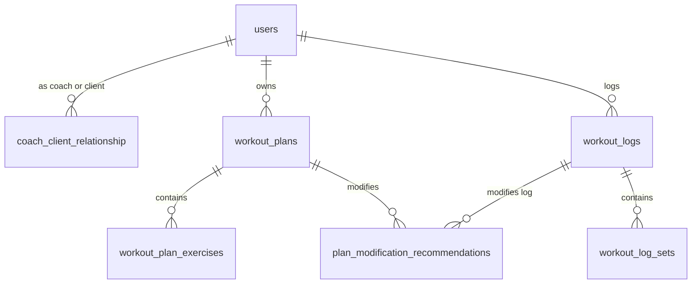

# Data Model: MVP Core Workouts & Access Control

This document defines the PostgreSQL physical database design and entity structures for the RSFit core domain.

## Schema ER Diagram Overview



---

## 1. Tables & Columns Definition

### Table: `users`
Represents coaches and clients registered on the platform.
```sql
CREATE TABLE users (
    id UUID PRIMARY KEY DEFAULT gen_random_uuid(),
    email VARCHAR(255) UNIQUE NOT NULL,
    password_hash VARCHAR(255) NOT NULL,
    role VARCHAR(32) NOT NULL, -- 'COACH', 'CLIENT'
    created_at TIMESTAMP WITHOUT TIME ZONE DEFAULT CURRENT_TIMESTAMP NOT NULL
);
```

### Table: `coach_client_relationship`
Stores many-to-many associations between coaches and clients.
```sql
CREATE TABLE coach_client_relationship (
    coach_id UUID NOT NULL REFERENCES users(id) ON DELETE CASCADE,
    client_id UUID NOT NULL REFERENCES users(id) ON DELETE CASCADE,
    status VARCHAR(32) NOT NULL, -- 'PENDING', 'ACTIVE', 'TERMINATED'
    created_at TIMESTAMP WITHOUT TIME ZONE DEFAULT CURRENT_TIMESTAMP NOT NULL,
    PRIMARY KEY (coach_id, client_id)
);
CREATE INDEX idx_rel_client ON coach_client_relationship(client_id);
```

### Table: `workout_plans`
Workout plan templates assigned to or created by clients.
```sql
CREATE TABLE workout_plans (
    id UUID PRIMARY KEY DEFAULT gen_random_uuid(),
    client_id UUID NOT NULL REFERENCES users(id) ON DELETE CASCADE,
    name VARCHAR(255) NOT NULL,
    creator_id UUID NOT NULL REFERENCES users(id),
    is_active BOOLEAN DEFAULT TRUE NOT NULL,
    created_at TIMESTAMP WITHOUT TIME ZONE DEFAULT CURRENT_TIMESTAMP NOT NULL
);
CREATE INDEX idx_workout_plans_client ON workout_plans(client_id);
```

### Table: `workout_plan_exercises`
List of target exercises within a workout plan.
```sql
CREATE TABLE workout_plan_exercises (
    id UUID PRIMARY KEY DEFAULT gen_random_uuid(),
    plan_id UUID NOT NULL REFERENCES workout_plans(id) ON DELETE CASCADE,
    exercise_name VARCHAR(128) NOT NULL,
    target_sets INTEGER NOT NULL,
    target_reps INTEGER NOT NULL,
    target_weight NUMERIC(5,2), -- Support kilograms/pounds up to 999.99
    display_order INTEGER NOT NULL
);
CREATE INDEX idx_plan_ex_plan ON workout_plan_exercises(plan_id);
```

### Table: `workout_logs`
Logged workout sessions performed by clients.
```sql
CREATE TABLE workout_logs (
    id UUID PRIMARY KEY DEFAULT gen_random_uuid(),
    client_id UUID NOT NULL REFERENCES users(id) ON DELETE CASCADE,
    plan_id UUID REFERENCES workout_plans(id) ON DELETE SET NULL, -- Can be logged without a template
    name VARCHAR(255) NOT NULL,
    status VARCHAR(32) NOT NULL, -- 'IN_PROGRESS', 'COMPLETED'
    start_time TIMESTAMP WITHOUT TIME ZONE NOT NULL,
    end_time TIMESTAMP WITHOUT TIME ZONE
);
CREATE INDEX idx_workout_logs_client ON workout_logs(client_id);
```

### Table: `workout_log_sets`
Logged performance data for each set completed by the client.
```sql
CREATE TABLE workout_log_sets (
    id UUID PRIMARY KEY DEFAULT gen_random_uuid(),
    log_id UUID NOT NULL REFERENCES workout_logs(id) ON DELETE CASCADE,
    exercise_name VARCHAR(128) NOT NULL,
    set_index INTEGER NOT NULL,
    reps INTEGER NOT NULL,
    weight NUMERIC(5,2) NOT NULL,
    completed BOOLEAN DEFAULT TRUE NOT NULL
);
CREATE INDEX idx_log_sets_log ON workout_log_sets(log_id);
```

### Table: `plan_modification_recommendations`
Stores proposed changes suggested by a coach, waiting for client action.
```sql
CREATE TABLE plan_modification_recommendations (
    id UUID PRIMARY KEY DEFAULT gen_random_uuid(),
    client_id UUID NOT NULL REFERENCES users(id) ON DELETE CASCADE,
    coach_id UUID NOT NULL REFERENCES users(id) ON DELETE SET NULL,
    plan_id UUID REFERENCES workout_plans(id) ON DELETE CASCADE,
    log_id UUID REFERENCES workout_logs(id) ON DELETE CASCADE, -- Can target templates or dynamic logs
    proposed_changes JSONB NOT NULL, -- Schema description of changes (e.g. added exercises, adjusted weights)
    status VARCHAR(32) NOT NULL, -- 'PENDING_APPROVAL', 'APPROVED', 'REJECTED'
    created_at TIMESTAMP WITHOUT TIME ZONE DEFAULT CURRENT_TIMESTAMP NOT NULL
);
CREATE INDEX idx_mod_rec_client ON plan_modification_recommendations(client_id, status);
```

---

## 2. Integrity & Authorization Rules

1. **Self-Ownership constraint**:
   A client always has direct read/write permission to their own `workout_plans`, `workout_logs`, and `workout_log_sets`.
2. **Coach Permission Gate**:
   A coach is authorized to read records in `workout_plans`, `workout_logs`, and `workout_log_sets` or create `plan_modification_recommendations` *if and only if* there exists a record in `coach_client_relationship` where `coach_id` is the querying user's ID, `client_id` is the target record's owner, and the `status` is `'ACTIVE'`.
3. **Draft Separation**:
   Pending recommendations are stored in `plan_modification_recommendations` and do **not** join into `workout_plans` or `workout_logs` in standard API calls until their status changes to `'APPROVED'`.
