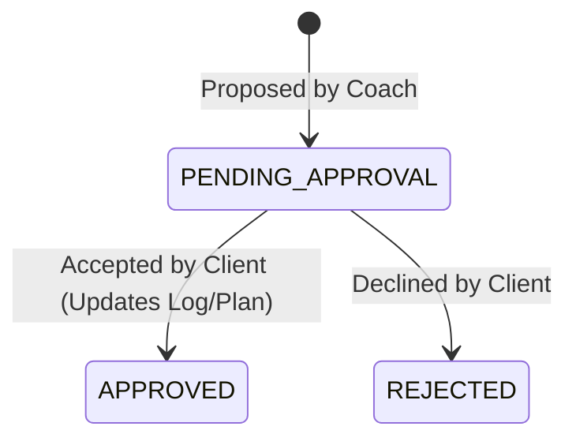

# Research Notes: MVP Core Workouts & Access Control

This document compiles the research findings, design decisions, and technology selections for the initial architecture of the RSFit system.

## 1. Modular Monolith in Spring Boot

### Decision
We will use a multi-module Maven structure (`pom.xml` inheritance) to implement a modular monolith rather than a single monolithic project or distributed microservices.

### Rationale
* **Encapsulation**: Promotes strict compile-time boundaries. A module (e.g., `rsfit-workouts`) cannot call classes inside another module (e.g., `rsfit-coaching`) unless explicitly added as a dependency.
* **Refactoring ease**: Prevents tight coupling of business logic. If modular limits are respected, migrating a module to a microservice in the future will require minimal code changes.
* **Build efficiency**: Supports incremental builds (`mvn -pl rsfit-workouts compile`).

### Alternatives Considered
* **Single project with package separation**: Simple to set up but easily bypassed by developers import-crossing packages. Rejected to enforce compile-time barriers.
* **Microservices**: High operational complexity, networking overhead, and deployment overhead. Too heavy for a startup MVP.

---

## 2. Multi-Coach and Multi-Client Relationship Model

### Decision
Represent relationships between coaches and clients as a rich join entity `CoachClientRelationship` with composite primary keys (`coach_id`, `client_id`) in PostgreSQL, along with indexes on both columns.

```sql
CREATE TABLE coach_client_relationship (
    coach_id UUID NOT NULL,
    client_id UUID NOT NULL,
    status VARCHAR(32) NOT NULL, -- PENDING_ACCEPTANCE, ACTIVE, TERMINATED
    created_at TIMESTAMP WITHOUT TIME ZONE NOT NULL,
    PRIMARY KEY (coach_id, client_id),
    FOREIGN KEY (coach_id) REFERENCES users(id) ON DELETE CASCADE,
    FOREIGN KEY (client_id) REFERENCES users(id) ON DELETE CASCADE
);

CREATE INDEX idx_relationship_client ON coach_client_relationship(client_id);
```

### Rationale
* Indexing both `coach_id` and `client_id` ensures $O(1)$ lookup for checking whether a given coach has authorization to view/edit a client's logs.
* Many-to-many relationship mapping allows specialized coaching (e.g., coach A manages training, coach B manages diet).

---

## 3. Workout Modification Approvals Workflow

### Decision
Implement an immutable history state machine for modifications. Proposing changes does not edit the target `WorkoutPlan` or `WorkoutLog` record directly. Instead, it creates a `PlanModificationRecommendation` entry containing the diff in JSON format.



When a recommendation is `APPROVED`:
1. The transaction applies the JSON patch to the target `WorkoutLog` or `WorkoutPlan` entity.
2. The recommendation state updates to `APPROVED`.
3. The edit history is persisted.

### Rationale
* **Client Autonomy**: Fully honors the constitution's Principle V.
* **Audit Trail**: Keeps a history of what coaches suggested and what clients accepted/rejected.

---

## 4. Grounded AI Integration (RAG)

### Decision
To keep RAG simple and cost-efficient in the MVP:
1. When a client requests a brief or asks a training question, the backend queries the PostgreSQL database for the client's logs over the relevant timeframe (e.g., "today's nutrition and workout logs").
2. The retrieved database rows are serialized into a text context.
3. This context is injected into the LLM system prompt along with safety instructions.
4. We will use **Spring AI** to communicate with the LLM API (OpenAI/Anthropic/Gemini) to generate the response.

### Alternatives Considered
* **Vector DB Embedding indexing**: Unnecessary for structured data (like logs) where SQL aggregation is more precise and covers 100% of the relevant logs. We will stick to structured SQL context injection.
