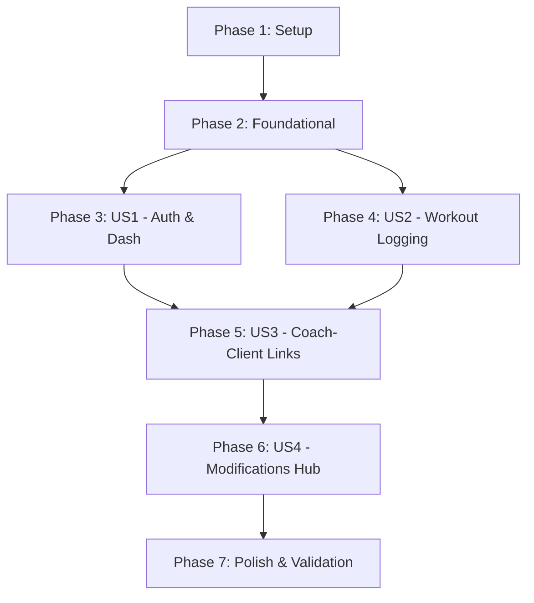

# Tasks: MVP Core Workouts & Access Control

**Input**: Design documents from `/specs/001-mvp-core-workouts/`

**Prerequisites**: [spec.md](spec.md) (required), [plan.md](plan.md) (required), [research.md](research.md), [data-model.md](data-model.md), [contracts/](contracts/)

**Tests**: Running integration tests via curl scripts is included in the validation checklist at the end.

**Organization**: Tasks are grouped by user story phases to ensure each priority level is fully deliverable and testable independently.

## Format: `[ID] [P?] [Story] Description`

- **[P]**: Can run in parallel (editing different files, no dependencies)
- **[Story]**: Which user story this task belongs to (e.g. US1, US2, US3, US4)

---

## Phase 1: Setup (Shared Infrastructure)

**Purpose**: Project multi-module and multi-workspace initialization.

- [x] T001 Initialize the Maven parent configuration in `backend/pom.xml`
- [x] T002 [P] Initialize `backend/rsfit-auth/pom.xml` Maven submodule
- [x] T003 [P] Initialize `backend/rsfit-coaching/pom.xml` Maven submodule
- [x] T004 [P] Initialize `backend/rsfit-workouts/pom.xml` Maven submodule
- [x] T005 [P] Initialize `backend/rsfit-api/pom.xml` Maven submodule
- [x] T006 [P] Initialize React Native project directory structure under `frontend/mobile/package.json`
- [x] T007 [P] Initialize Vite React project directory structure under `frontend/web/package.json`

---

## Phase 2: Foundational (Blocking Prerequisites)

**Purpose**: Setup basic application configurations, DB configurations, and security middleware.

**⚠️ CRITICAL**: No user story implementation can begin until these configuration structures are in place.

- [x] T008 Setup database configuration and schema connection pools in `backend/rsfit-api/src/main/resources/application.yml`
- [x] T009 [P] Create PostgreSQL database entity schema validation / migrations in `backend/rsfit-api/src/main/resources/db/migration/V1__init_schema.sql`
- [x] T010 Create abstract security filter chain and JWT utilities in `backend/rsfit-auth/src/main/java/com/rsfit/auth/security/JwtUtils.java`
- [x] T011 [P] Create basic exception handling controller advice in `backend/rsfit-api/src/main/java/com/rsfit/api/exception/GlobalExceptionHandler.java`

**Checkpoint**: Foundation ready - user story implementation can now begin.

---

## Phase 3: User Story 1 - User Authentication & Role-Based Dashboard (Priority: P1) 🎯 MVP

**Goal**: Enable secure login, user authentication, and basic client/coach dashboards based on JWT tokens.

**Independent Test**: Register a Client and a Coach. Verify that Logging in as the Coach displays a client management portal, while logging in as the Client displays workout logging tools.

### Implementation for User Story 1

- [x] T012 [P] [US1] Create the User Entity definition in `backend/rsfit-auth/src/main/java/com/rsfit/auth/entity/User.java`
- [x] T013 [P] [US1] Create UserRepository JPA interface in `backend/rsfit-auth/src/main/java/com/rsfit/auth/repository/UserRepository.java`
- [x] T014 [US1] Implement user registration and login logic in `backend/rsfit-auth/src/main/java/com/rsfit/auth/service/AuthService.java`
- [x] T015 [US1] Expose authentication REST controllers in `backend/rsfit-api/src/main/java/com/rsfit/api/controller/AuthController.java`
- [x] T016 [P] [US1] Implement user authentication and login state context in `frontend/mobile/src/context/AuthContext.js`
- [x] T017 [US1] Build mobile login and signup screens in `frontend/mobile/src/screens/LoginScreen.js`
- [x] T018 [P] [US1] Build web coach dashboard shell in `frontend/web/src/pages/CoachDashboard.js`

**Checkpoint**: User Story 1 is functional. Login and auth validations pass.

---

## Phase 4: User Story 2 - Workout Logging by Client (Priority: P1) 🎯 MVP

**Goal**: Allow clients to log weights, sets, and reps for exercises in the gym, storing completion logs.

**Independent Test**: Start an active workout, log 2 sets of Squats, complete the workout, and verify it persists correctly in database logs.

### Implementation for User Story 2

- [x] T019 [P] [US2] Create WorkoutLog and WorkoutLogSet JPA entity classes in `backend/rsfit-workouts/src/main/java/com/rsfit/workouts/entity/WorkoutLog.java` and `backend/rsfit-workouts/src/main/java/com/rsfit/workouts/entity/WorkoutLogSet.java`
- [x] T020 [P] [US2] Create WorkoutLogRepository and WorkoutLogSetRepository JPA interfaces in `backend/rsfit-workouts/src/main/java/com/rsfit/workouts/repository/WorkoutLogRepository.java` and `backend/rsfit-workouts/src/main/java/com/rsfit/workouts/repository/WorkoutLogSetRepository.java`
- [x] T021 [US2] Implement logging creation, set tracking, and completion operations in `backend/rsfit-workouts/src/main/java/com/rsfit/workouts/service/WorkoutLoggingService.java`
- [x] T022 [US2] Expose workout logging REST controllers in `backend/rsfit-api/src/main/java/com/rsfit/api/controller/WorkoutLogController.java`
- [x] T023 [P] [US2] Create mobile workout active tracking screen in `frontend/mobile/src/screens/ActiveWorkoutScreen.js`
- [x] T024 [US2] Create mobile workout log history view screen in `frontend/mobile/src/screens/WorkoutHistoryScreen.js`

**Checkpoint**: User Story 2 is functional. Workout log creation, set tracking, and dynamic logging are active on the mobile client.

---

## Phase 5: User Story 3 - Coach-Client Multi-Link & Workspace (Priority: P2)

**Goal**: Support linking clients to one or more coaches, granting coaches read-only access to client files.

**Independent Test**: Connect Coach A and Client A. Verify that Coach A can view Client A's logs, but Coach B cannot.

### Implementation for User Story 3

- [x] T025 [P] [US3] Create CoachClientRelationship JPA entity class in `backend/rsfit-coaching/src/main/java/com/rsfit/coaching/entity/CoachClientRelationship.java`
- [x] T026 [P] [US3] Create CoachClientRelationshipRepository JPA interface in `backend/rsfit-coaching/src/main/java/com/rsfit/coaching/repository/CoachClientRelationshipRepository.java`
- [x] T027 [US3] Implement link invitation, acceptance, and validation security checks in `backend/rsfit-coaching/src/main/java/com/rsfit/coaching/service/CoachingService.java`
- [x] T028 [US3] Expose coaching association REST controllers in `backend/rsfit-api/src/main/java/com/rsfit/api/controller/CoachingController.java`
- [x] T029 [P] [US3] Design client roster listing screen for coaches in `frontend/web/src/pages/ClientRosterPage.js`
- [x] T030 [US3] Implement client-side connection manager to view and link with coaches in `frontend/mobile/src/screens/CoachesListScreen.js`

**Checkpoint**: User Story 3 is functional. Relationship authorization restricts read/write permissions.

---

## Phase 6: User Story 4 - Coach Recommended Workout Modifications (Priority: P2)

**Goal**: Support coach-suggested changes to client plans and logs, holding them in a pending approvals hub.

**Independent Test**: Coach recommends editing target weight on Client's log. Client approves from the mobile Approvals Hub, verifying that the target weight changes successfully.

### Implementation for User Story 4

- [x] T031 [P] [US4] Create PlanModificationRecommendation JPA entity in `backend/rsfit-workouts/src/main/java/com/rsfit/workouts/entity/PlanModificationRecommendation.java`
- [x] T032 [P] [US4] Create PlanModificationRecommendationRepository interface in `backend/rsfit-workouts/src/main/java/com/rsfit/workouts/repository/PlanModificationRecommendationRepository.java`
- [x] T033 [US4] Implement logic to stage recommended changes, list pending approvals, and apply JSON diffs to target logs in `backend/rsfit-workouts/src/main/java/com/rsfit/workouts/service/ApprovalsService.java`
- [x] T034 [US4] Expose recommendation and approvals REST controllers in `backend/rsfit-api/src/main/java/com/rsfit/api/controller/ApprovalsController.java`
- [x] T035 [P] [US4] Implement mobile client Approvals Hub tab screen in `frontend/mobile/src/screens/ApprovalsHubScreen.js`
- [x] T036 [US4] Create web coach modification dispatcher form in `frontend/web/src/components/RecommendModificationForm.js`

**Checkpoint**: User Story 4 is functional. Approvals workflow applies modifications.

---

## Phase 7: Polish & Cross-Cutting Concerns

**Purpose**: Cross-cutting code cleanups, deployment validations, and polish.

- [x] T037 Implement JWT validation refresh handling and error interceptors in `frontend/mobile/src/api/client.js`
- [x] T038 Run integration test validations against the backend endpoints using the commands detailed in `specs/001-mvp-core-workouts/quickstart.md`
- [x] T039 [P] Document the local deploy procedures in `README.md`

---

## Dependencies & Execution Order

### Parallel Opportunities

* Setup: T002, T003, T004, T005, T006, and T007 can be executed concurrently.
* Foundational: Schema creation (T009) and exception middleware configurations (T011) can run parallel to core connection setups.
* User Stories: Once Phase 3 (US1 Auth) is complete, frontends (T016, T017, T018) can be developed independently of backend services.

---

## Implementation Strategy

### MVP First (Phases 1-4)
To reach a testable product slice as quickly as possible:
1. Initialize the monorepo structures (Phase 1) and core PostgreSQL/JPA layers (Phase 2).
2. Implement user logins and role assignments (Phase 3).
3. Deliver client-side workout log tracking on mobile (Phase 4).
4. Run validation scripts to verify a client can register and log custom sets.
