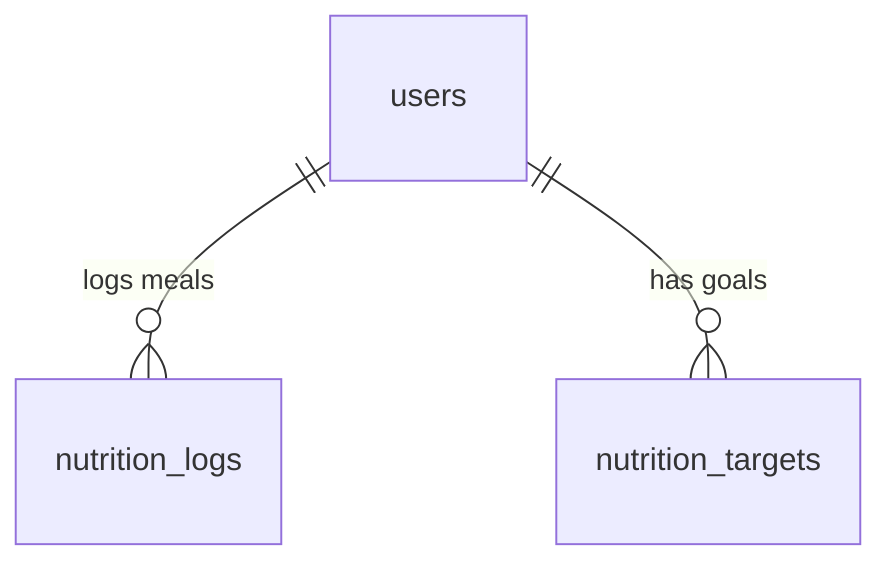

# Data Model: Nutrition & Diet Tracker

This document defines the PostgreSQL physical schema layout and entity definitions for the diet tracking domain.

## Schema Overview



---

## 1. Tables & Columns Definition

### Table: `nutrition_logs`
Stores individual meal and food entries logged by clients.
```sql
CREATE TABLE nutrition_logs (
    id UUID PRIMARY KEY DEFAULT gen_random_uuid(),
    client_id UUID NOT NULL REFERENCES users(id) ON DELETE CASCADE,
    food_name VARCHAR(255) NOT NULL,
    calories INTEGER NOT NULL CHECK (calories >= 0),
    protein NUMERIC(5,2) NOT NULL DEFAULT 0.00 CHECK (protein >= 0),
    carbohydrates NUMERIC(5,2) NOT NULL DEFAULT 0.00 CHECK (carbohydrates >= 0),
    fat NUMERIC(5,2) NOT NULL DEFAULT 0.00 CHECK (fat >= 0),
    logged_at TIMESTAMP WITHOUT TIME ZONE DEFAULT CURRENT_TIMESTAMP NOT NULL
);
CREATE INDEX idx_nut_logs_client_date ON nutrition_logs(client_id, logged_at);
```

### Table: `nutrition_targets`
Daily targets for calories and macronutrients, established by clients or recommended by coaches.
```sql
CREATE TABLE nutrition_targets (
    id UUID PRIMARY KEY DEFAULT gen_random_uuid(),
    client_id UUID NOT NULL REFERENCES users(id) ON DELETE CASCADE,
    target_calories INTEGER NOT NULL CHECK (target_calories > 0),
    target_protein INTEGER NOT NULL CHECK (target_protein > 0),
    target_carbs INTEGER NOT NULL CHECK (target_carbs > 0),
    target_fat INTEGER NOT NULL CHECK (target_fat > 0),
    is_active BOOLEAN DEFAULT TRUE NOT NULL,
    created_at TIMESTAMP WITHOUT TIME ZONE DEFAULT CURRENT_TIMESTAMP NOT NULL
);
CREATE INDEX idx_nut_targets_client ON nutrition_targets(client_id) WHERE is_active = TRUE;
```

---

## 2. Integrity & Authorization Rules

1. **Active Target Uniqueness**:
   A client must have at most one active `nutrition_targets` record (`is_active = TRUE`). When a new target is activated, any previous active target for the same client must be set to `is_active = FALSE`.
2. **Access Security Gates**:
   * Clients have full read/write permission to their own `nutrition_logs` and `nutrition_targets`.
   * Coaches are authorized to read records in `nutrition_logs` and `nutrition_targets` or create target adjustment proposals *if and only if* there exists an active relationship link in `coach_client_relationship`.
