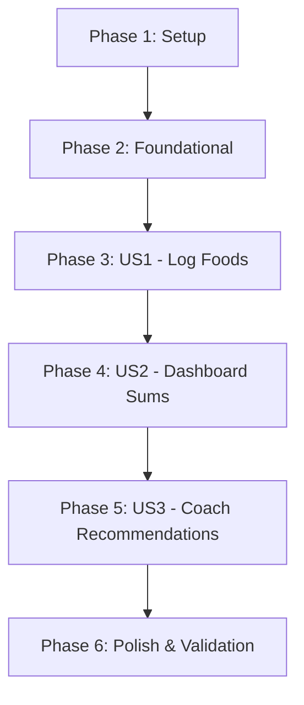

# Tasks: Nutrition & Diet Tracker

**Input**: Design documents from `/specs/002-nutrition-tracker/`

**Prerequisites**: [spec.md](spec.md) (required), [plan.md](plan.md) (required), [research.md](research.md), [data-model.md](data-model.md), [contracts/](contracts/)

**Tests**: Running integration tests via curl scripts is included in the validation checklist at the end.

**Organization**: Tasks are grouped by user story phases to ensure each priority level is fully deliverable and testable independently.

## Format: `[ID] [P?] [Story] Description`

- **[P]**: Can run in parallel (editing different files, no dependencies)
- **[Story]**: Which user story this task belongs to (e.g. US1, US2, US3)

---

## Phase 1: Setup (Shared Infrastructure)

**Purpose**: Module structure definition.

- [x] T001 Initialize the Maven module `rsfit-nutrition` in `backend/rsfit-nutrition/pom.xml`
- [x] T002 Add the `rsfit-nutrition` module declaration to parent POM `backend/pom.xml` and dependency injection mappings

---

## Phase 2: Foundational (Blocking Prerequisites)

**Purpose**: Database migrations setup.

- [x] T003 Create the database migration script defining `nutrition_logs` and `nutrition_targets` tables in `backend/rsfit-api/src/main/resources/db/migration/V2__add_nutrition.sql`

---

## Phase 3: User Story 1 - Client Logs Daily Food Entries (Priority: P1) 🎯 MVP

**Goal**: Client logs food items (calories/macros) successfully.

**Independent Test**: Post a meal log, verify it maps to database tables.

### Implementation for User Story 1

- [x] T004 [P] [US1] Create NutritionLog entity definition in `backend/rsfit-nutrition/src/main/java/com/rsfit/nutrition/entity/NutritionLog.java`
- [x] T005 [P] [US1] Create NutritionLogRepository JPA interface in `backend/rsfit-nutrition/src/main/java/com/rsfit/nutrition/repository/NutritionLogRepository.java`
- [x] T006 [US1] Implement meal logging methods in `backend/rsfit-nutrition/src/main/java/com/rsfit/nutrition/service/NutritionService.java`
- [x] T007 [US1] Expose food logging endpoints in `backend/rsfit-api/src/main/java/com/rsfit/api/controller/NutritionController.java`
- [x] T008 [P] [US1] Create mobile add meal screen form in `frontend/mobile/src/screens/AddMealScreen.js`

---

## Phase 4: User Story 2 - Daily Progress Dashboard (Priority: P1) 🎯 MVP

**Goal**: View aggregate sums of daily calories/macros alongside goals.

**Independent Test**: Log food, run daily aggregates summary, verify correctness.

### Implementation for User Story 2

- [x] T009 [P] [US2] Create NutritionTarget JPA entity in `backend/rsfit-nutrition/src/main/java/com/rsfit/nutrition/entity/NutritionTarget.java`
- [x] T010 [P] [US2] Create NutritionTargetRepository JPA interface in `backend/rsfit-nutrition/src/main/java/com/rsfit/nutrition/repository/NutritionTargetRepository.java`
- [x] T011 [US2] Implement timezone-offset daily aggregates summation query in `backend/rsfit-nutrition/src/main/java/com/rsfit/nutrition/repository/NutritionLogRepository.java` (using AT TIME ZONE logic)
- [x] T012 [US2] Implement daily summary calculations in `backend/rsfit-nutrition/src/main/java/com/rsfit/nutrition/service/NutritionService.java`
- [x] T013 [US2] Expose summary query endpoints in `backend/rsfit-api/src/main/java/com/rsfit/api/controller/NutritionController.java`
- [x] T014 [P] [US2] Create mobile MacroSummary display card in `frontend/mobile/src/components/MacroSummary.js`
- [x] T015 [US2] Build client mobile nutrition dashboard screen in `frontend/mobile/src/screens/NutritionDashboard.js`

---

## Phase 5: User Story 3 - Coach Nutrition Oversight & Recommendations (Priority: P2)

**Goal**: Coach recommends target settings, client accepts via Approvals Hub.

**Independent Test**: Coach recommends daily goals, client clicks approve, verify target updates.

### Implementation for User Story 3

- [x] T016 [US3] Add target updates and coach links checks in `backend/rsfit-nutrition/src/main/java/com/rsfit/nutrition/service/NutritionService.java`
- [x] T017 [US3] Expose targets recommendation REST controllers in `backend/rsfit-api/src/main/java/com/rsfit/api/controller/NutritionController.java`
- [x] T018 [US3] Update Approvals Hub transaction logic in `backend/rsfit-workouts/src/main/java/com/rsfit/workouts/service/ApprovalsService.java` to support applying `ADJUST_NUTRITION_TARGETS` payloads (invoking target activations)
- [x] T019 [P] [US3] Update mobile client approvals cards to render target adjustments proposals in `frontend/mobile/src/screens/ApprovalsHubScreen.js`
- [x] T020 [US3] Design web coach target adjustment forms in `frontend/web/src/components/RecommendTargetsForm.js`

---

## Phase 6: Polish & Cross-Cutting Concerns

**Purpose**: Verification and documentation.

- [x] T021 Run integration tests via curl scripts detailed in `specs/002-nutrition-tracker/quickstart.md`
- [x] T022 Document deployment updates in `README.md`

---

## Dependencies & Execution Order

