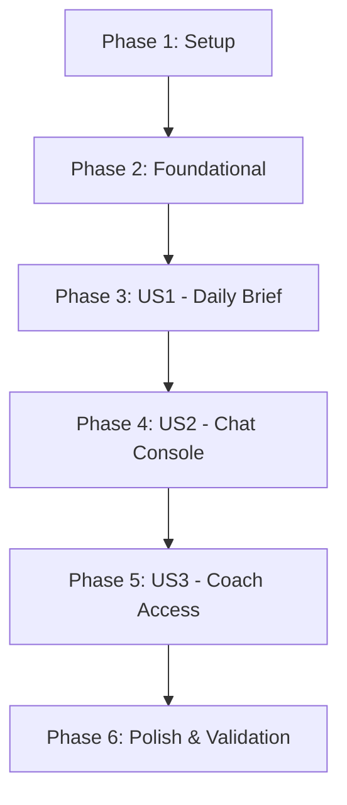

# Tasks: LLM AI Gateway

**Input**: Design documents from `/specs/003-ai-gateway/`

**Prerequisites**: [spec.md](spec.md) (required), [plan.md](plan.md) (required), [research.md](research.md), [data-model.md](data-model.md), [contracts/](contracts/)

**Tests**: Running integration tests via curl scripts is included in the validation checklist at the end.

**Organization**: Tasks are grouped by user story phases to ensure each priority level is fully deliverable and testable independently.

## Format: `[ID] [P?] [Story] Description`

- **[P]**: Can run in parallel (editing different files, no dependencies)
- **[Story]**: Which user story this task belongs to (e.g. US1, US2, US3)

---

## Phase 1: Setup (Shared Infrastructure)

**Purpose**: Spring AI dependencies configuration.

- [x] T001 Configure Vertex AI Gemini starters dependency in `backend/rsfit-workouts/pom.xml` or parent pom
- [x] T002 Inject Spring AI properties configured for Gemini in `backend/rsfit-api/src/main/resources/application.yml`

---

## Phase 2: Foundational (RAG Service & Grounding Prompts)

**Purpose**: Staging grounding context formats and fallback chat clients.

- [x] T003 Implement the `AiGatewayService` structure in `backend/rsfit-workouts/src/main/java/com/rsfit/workouts/service/AiGatewayService.java`
- [x] T004 Program prompt string compilers formatting daily workout logs and nutrition summaries into a RAG prompt context
- [x] T005 Create the conditional mock `ChatClient` fallback bean configuration in `backend/rsfit-workouts/src/main/java/com/rsfit/workouts/config/AiConfig.java`

---

## Phase 3: User Story 1 - On-Demand Client Daily Briefing (Priority: P1) 🎯 MVP

**Goal**: Client requests on-demand natural language daily briefings.

**Independent Test**: Generate a daily brief, verifying it summarizes logged food and workouts.

### Implementation for User Story 1

- [x] T006 [US1] Implement daily brief generation methods in `backend/rsfit-workouts/src/main/java/com/rsfit/workouts/service/AiGatewayService.java`
- [x] T007 [US1] Expose brief generation endpoints in `backend/rsfit-api/src/main/java/com/rsfit/api/controller/AiController.java`
- [x] T008 [P] [US1] Build mobile client Daily Briefing display view in `frontend/mobile/src/screens/DailyBriefScreen.js`

---

## Phase 4: User Story 2 - Conversational Fitness Chat (Priority: P1) 🎯 MVP

**Goal**: Context-grounded fitness chat.

**Independent Test**: Ask chat a question about targets, verifying the response matches logs.

### Implementation for User Story 2

- [x] T009 [US2] Implement context-grounded conversational chat responses in `backend/rsfit-workouts/src/main/java/com/rsfit/workouts/service/AiGatewayService.java`
- [x] T010 [US2] Expose chat console endpoints in `backend/rsfit-api/src/main/java/com/rsfit/api/controller/AiController.java`
- [x] T011 [P] [US2] Create mobile chat console screen in `frontend/mobile/src/screens/FitnessChatScreen.js`

---

## Phase 5: User Story 3 - Coach Oversight of Client Briefs (Priority: P2)

**Goal**: Coach retrieves client briefing reports safely.

**Independent Test**: Coach requests linked client brief successfully, unlinked coach is blocked.

### Implementation for User Story 3

- [x] T012 [US3] Add coach authorizations check for linked client briefing views in `backend/rsfit-api/src/main/java/com/rsfit/api/controller/AiController.java`
- [x] T013 [P] [US3] Design web coach client briefing card view in `frontend/web/src/components/ClientBriefingCard.js`

---

## Phase 6: Polish & Cross-Cutting Concerns

**Purpose**: Verification and documentation.

- [x] T014 Run integration tests validation using curl scripts from `specs/003-ai-gateway/quickstart.md`
- [x] T015 Document deployment updates in `README.md`

---

## Dependencies & Execution Order

